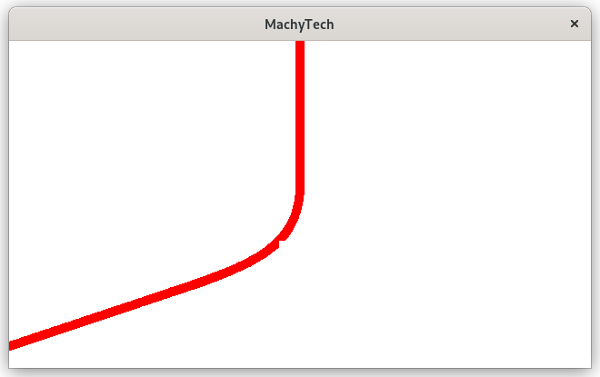

# robot-intention-feedback

Superfast C++ API for rendering scenes in an autonomous robot.

## git submodules

we are using glfw and glmath that you need to install as git submodules.
```
git submodule update --init --recursive
```

## Quick Compile
This was a group project. To get everyone up to speed as quickly as possible we needed a common build environment. In order to get started quickly with this project you need to install docker and execute the following.
```
docker build -t robot-intention-feedback .
docker run -it --mount src="$(pwd)",target=/home/,type=bind robot-intention-feedback
```
Now in the container you can easily build the project
```
cd /home/code
mkdir build && cd build
cmake ../ && make -j4
```
If the build is succesfull stop the container and simulate the robot trajectory using python's build in http server. I am using libcurl on the client side to receive the trajectory data.
```
cd tests/trajectories
python3 -m http.server
```

```
./app
``` 

You should now see a window with an OpenGL context displaying the trajectory simulation.



## ARM cross-compiling

If you want to build the image for an ARM platform you can also pull the image from our machytech docker hub repository.
```
docker run -it --mount type=bind,source=<path-to-target>,target=/home docker.io/machytech/armv7-build@sha256:f4f929ea0a0c451e0407b63fc2949cda6f3d335fc73c5068df483788b97f85f8 /bin/bash
```
build the image using the dockerfile. Assuming you have docker and buildx installed. Documentation is very good so check for latest installation instruction on their website. I have installed buildx from their github page, I would advise doing this as well.
To create a build instance for buildx do the following.
```
docker buildx create --name machytech-core-build
docker buildx create use machytech-core-build
```
Now run the docker file as machytech-core-build user
```
docker buildx build --platform linux/arm,linux/arm64 -t machytech/armv7-build . --push
```
This builds an armv7 and arm64 image and pushes it to machytech's docker hub.  
You can check the names of the created images here
```
docker buildx imagetools inspect machytech/armv7-build
```
Now copy the name from the armv7 image and run the container with a bash instance. Also mount the source code.
```
docker run -it --mount type=bind,source=<path-to-source>,target=/home <name> /bin/bash
```
## Linux Environment Variables

```
GLSL_APP_VERT shader/basic.frag #vertex shader directory
GLSL_APP_FRAG shader/basic.vert #fragment shader directory
SCENE robotpath #used scene
TCP_IP 127.0.0.1#tcp ip address
TCP_PORT 3000 # tcp port address
HTTP_IP 127.0.0.1 # http ip address
HTTP_PORT 3015 # http port address
HTTP_ROUTE /default # http route
CURL_WEBURL http://0.0.0.0:8000/trajectory_100_fpg_out.txt # web url to data file (for robot path)
SAMPLE_SIZE 5 # number of sample used from robot path
LINEWIDTH 10 # width of line
WINDOW_WIDTH 640 # width of openGL rendering context
WINDOW_HEIGHT 360 # height of openGL rendering context
```

## latest features
* Vertical window (29/05/2021)
* White background (29/05/2021)
* ARMv7 build image (05/05/2021)

docker build image ARMv7 with debian and depencies pre-installed

* filemanagement

Reading a csv file and store in the correct format for openGL.

* path scene

This feature includes code for the rendering of the csv file in openGL.

* libcurl file reader from http server

Reading remote csv files FAST!! using libcurl. 

* systemD service

.conf file for systemd service

## Future work

* Simulation mode environment variable
* Simulation: direct to trajectory file used for simulation
* Default scene on boot beaglebone
* Creating extra scenes
* Read odometry data from sensors
* Netwerk device driver(?)
* CI/CD (jenkins?) to Beaglebone
* logging

## Resources
* Hands-on Network Programming with C: Learn Socket Programming in C

Learn socket programming in C and write secure and optimized network code.

* openGL SuperBible

Usefull to get some context of graphics and the GPU. Very advanced.

* The C++ programming language: Bjarne Stroustrump

libcurl development

* https://curl.se/dev/
